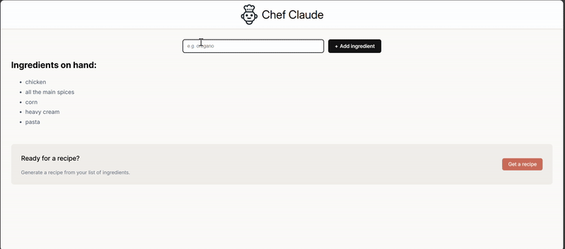

# 🧑‍🍳 Chef Claude

Chef Claude is an AI-powered recipe generator built with **React**. Simply enter a list of ingredients you have on hand, and Chef Claude will create a delicious, customized recipe using **Claude’s API** (Anthropic). It’s like having your own personal AI chef!

---

## 🚀 Features

- 🥕 Input any number of ingredients  
- 🍲 Generates a full recipe including instructions, ingredients, and cooking time  
- ✨ Uses **Claude API** for natural, creative recipe generation  
- ⚛️ Built with **React** (functional components + hooks)  
- 📱 Clean and responsive UI  

---

## 🧰 Tech Stack

| Category | Technology |
|-----------|-------------|
| Frontend | React (Vite) |
| Styling | CSS  |
| API | Claude API (via Anthropic SDK) |
| Language | JavaScript |
| Build Tool | Vite |

---

## Demo

Huge Thanks to Scrimba and Instructor Bob Ziroll for guiding me through this project!
